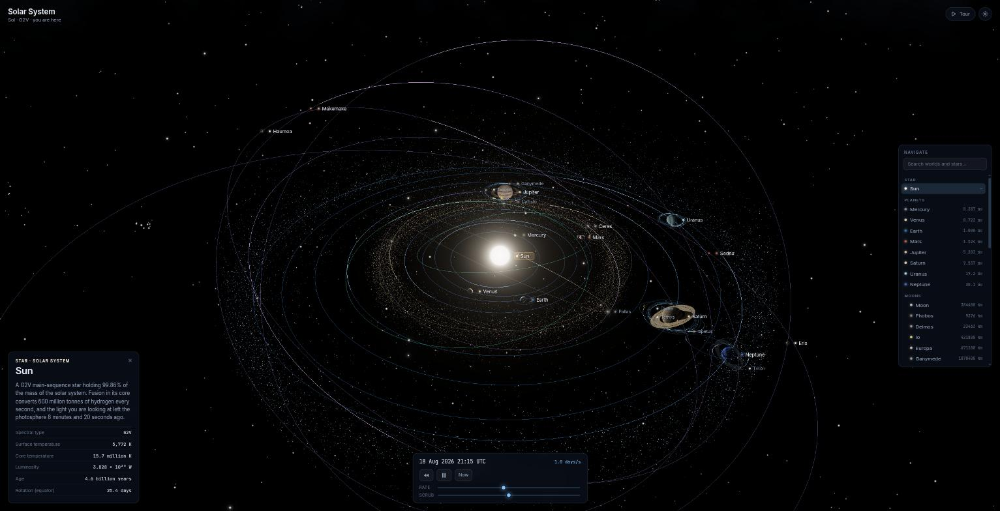

# Solar System Explorer

An interactive 3D map of the solar system and the stars around it, built with
three.js and TypeScript. Every number in it comes from a published catalogue —
nothing is invented, and where a value had to be estimated the interface says so.



## What's in it

**The solar system.** Eight planets, five dwarf planets, four major asteroids,
two comets and twenty-two moons, propagated from real orbital elements at any
date between roughly 3000 BC and 3000 AD. Saturn's rings cast a shadow on the
planet and the planet casts one back across the rings. The asteroid belt carries
its Kirkwood gaps — the resonances with Jupiter that the real belt has been
swept clean of.

**The solar neighbourhood.** 262 stars within about 27 light years at their real
three-dimensional positions, and the 61 catalogued planetary systems within 10
parsecs. Select a star that has planets and you fly into its system.

**Two scales.** Realistic, where the planets are true to size and almost
invisible against their orbits, and schematic, where orbits are compressed
logarithmically and bodies enlarged so the whole system reads at a glance. Press
`M` to blend between them.

## Running it

```bash
npm install
npm run dev
```

| Command | |
| --- | --- |
| `npm run dev` | development server |
| `npm run build` | typecheck and bundle |
| `npm run verify` | check the orbit propagator against JPL Horizons |
| `npm run build:catalog` | regenerate the data modules from `data/raw/` |

## Controls

Drag to orbit, scroll to zoom, click a body to inspect it, double-click to fly
to it.

| | |
| --- | --- |
| `Space` | play / pause |
| `←` `→` | slower / faster |
| `R` `N` | reverse time / jump to now |
| `Tab` | cycle through bodies |
| `M` `O` `L` `B` `H` `G` | scale · orbits · labels · belts · habitable zone · grid |
| `T` | guided tour |
| `Backspace` | back to the star map |

## Where the data comes from

| Source | Used for |
| --- | --- |
| [JPL approximate positions](https://ssd.jpl.nasa.gov/planets/approx_pos.html) | Keplerian elements and rates for the eight planets, both the 1800–2050 table and the wide-range one |
| [JPL Small-Body Database](https://ssd-api.jpl.nasa.gov/doc/sbdb.html) | osculating elements for dwarf planets, asteroids and comets |
| [NASA Exoplanet Archive](https://exoplanetarchive.ipac.caltech.edu/) | 121 planets and their host stars within 10 parsecs |
| [SIMBAD](https://simbad.cds.unistra.fr/) (CDS) | nearby stars, and the 5,051 naked-eye stars of the background sky |
| [NASA/NSSDC fact sheets](https://nssdc.gsfc.nasa.gov/planetary/) | planetary and satellite physical parameters |

`data/raw/` holds the catalogue responses exactly as they were downloaded;
`npm run build:catalog` turns them into the typed modules in `src/data/*.gen.ts`.

## Accuracy

`npm run verify` compares the propagator against JPL Horizons state vectors at
three epochs. Inside the 1800–2050 window the inner planets land within about
0.01% of their heliocentric distance; Jupiter and Saturn are the worst at 0.06%
and 0.13%, which is the documented limit of a linear-rate approximation against
their mutual perturbations. At 1000 AD and 2900 AD, where the wide-range
elements take over, everything stays inside 0.3%.

Planetary surfaces are generated procedurally in GLSL rather than from imagery,
so they are an impression of each world, not a photograph. The exoplanets are
more speculative still: their appearance is inferred from measured radius, mass
and irradiation, and the info panel says as much on every one of them. Their
orbital inclinations are unknown and have been spread apart for legibility.

## How it fits together

```
src/
  astro/       Julian dates, Kepler propagation, blackbody colour
  data/        catalogues — solarSystem.ts by hand, *.gen.ts generated
  shaders/     procedural surfaces, atmospheres, rings, stars, sky
  scene/       system view, star map, scale model, orbits, belts
  core/        renderer with bloom, floating-origin camera rig
  ui/          labels, info panel, HUD
```

Two details carry most of the weight. The **floating origin** in
`core/cameraRig.ts` draws the world relative to whatever body is focused, which
is the only way float32 vertex data can span a 1,700 km moon and a 500 au orbit
in the same frame. And the **scale model** in `scene/scale.ts` is the single
place that decides how far apart and how large anything is drawn, so the rest of
the code never has to care which mode is active.
